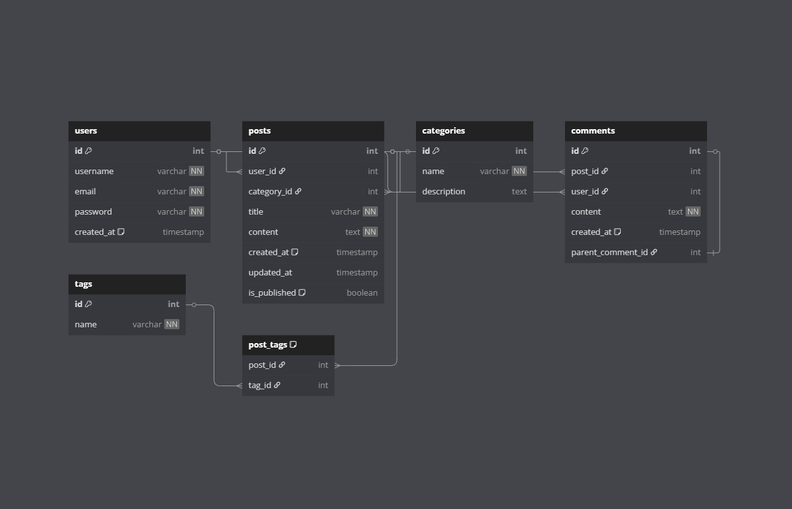

# 📚 Blog API

## 🛠 Backend

### 🚀 Özellikler

- 🔐 Login
- 📝 Register
- 🔍 Get Users by Filter
- ✏️ Update User
- 🗑️ Delete User
- 🔑 JWT Middleware
- 🛡️ Role Middleware

Table users {
  id int [pk, increment]
  username varchar [unique, not null]
  email varchar [unique, not null]
  password varchar [not null]
  created_at timestamp [default: `current_timestamp`]
}

Table posts {
  id int [pk, increment]
  user_id int [ref: > users.id]
  category_id int [ref: > categories.id]
  title varchar [not null]
  content text [not null]
  created_at timestamp [default: `current_timestamp`]
  updated_at timestamp
  is_published boolean [default: false]
}

Table categories {
  id int [pk, increment]
  name varchar [not null, unique]
  description text
}

Table comments {
  id int [pk, increment]
  post_id int [ref: > posts.id]
  user_id int [ref: > users.id]
  content text [not null]
  created_at timestamp [default: `current_timestamp`]
  parent_comment_id int [ref: - comments.id] // Nested comments support
}

Table tags {
  id int [pk, increment]
  name varchar [not null, unique]
}

Table post_tags {
  post_id int [ref: > posts.id]
  tag_id int [ref: > tags.id]
  Note: "Many-to-many relationship between posts and tags"
}
